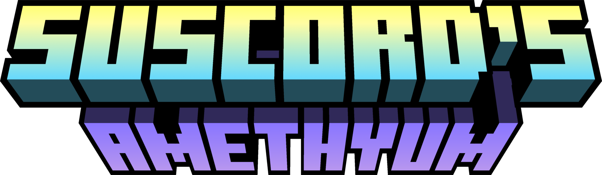

  
  <h1>Suscord's Amethyum</h1>

This is my very first Minecraft Modification made using Forge MDK

<h2>Licensing</h2>

Code and otherwise stated default to my [LICENSE file here](LICENSE)

<h2>Downloads</h2>

Currently, there is no active Download URLs for my mod Since it has Literelly no proper game Contents to enjoy. But if someone else Really wants to Try this Modification, I'd Recommend just Save the whole Repository and Build for Your own.
